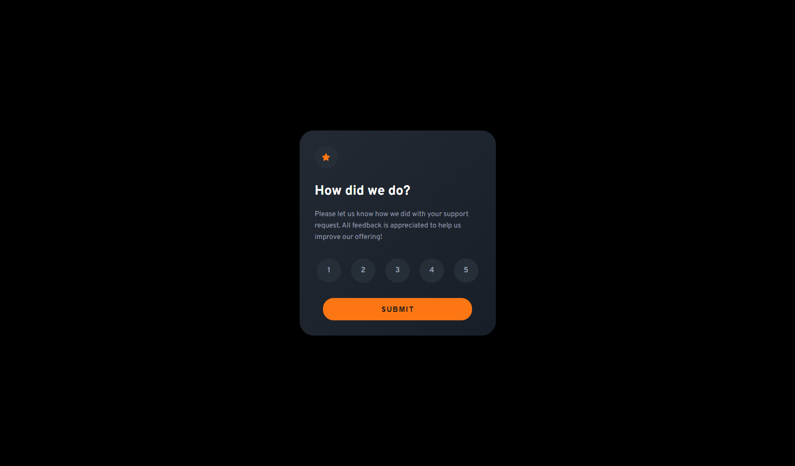

# Frontend Mentor - Interactive rating component solution

This is a solution to the [Interactive rating component challenge on Frontend Mentor](https://www.frontendmentor.io/challenges/interactive-rating-component-koxpeBUmI). Frontend Mentor challenges help you improve your coding skills by building realistic projects. 

## Table of contents

- [Overview](#overview)
  - [The challenge](#the-challenge)
  - [Screenshot](#screenshot)
  - [Links](#links)
- [My process](#my-process)
  - [Built with](#built-with)
  - [What I learned](#what-i-learned)
- [Author](#author)

## Overview

### The challenge

Users should be able to:

- View the optimal layout for the app depending on their device's screen size
- See hover states for all interactive elements on the page
- Select and submit a number rating
- See the "Thank you" card state after submitting a rating

### Screenshot

### Links

- Solution URL: [Add solution URL here](https://github.com/manojaba/Interactive-rating-componenet)
- Live Site URL: [Add live site URL here](https://manojaba.github.io/Interactive-rating-componenet/)

## My process

started with styling two card on the same position with toggling the display to none. added dom elements to js and manipulated the display property of the cards by handling events.

### Built with

- Semantic HTML5 markup
- CSS custom properties
- Flexbox
- JS

### What I learned

learnt how to target sibling and ancestor dom elements and how to add transition to elements

## Author

- linkedin - [Manoj Baskar](https://www.linkedin.com/in/manoj-baskar-42a734159/)
- Frontend Mentor - [@manojaba](https://www.frontendmentor.io/profile/manojaba)

